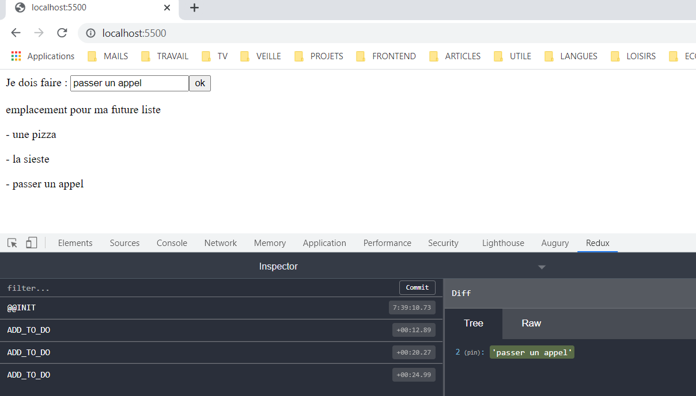
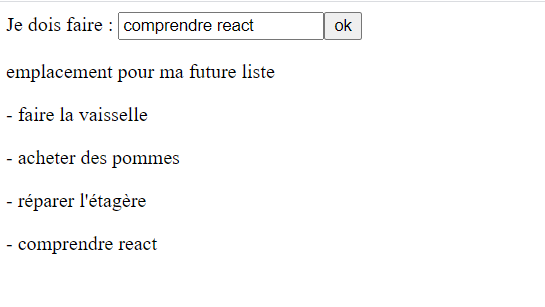

📣 Vous trouverez ici les commentaire de ceux qui ont déjà fait le tuto (en attendant leur intégration au tuto)
https://github.com/arolla/first-react-app-tutorial/wiki/Commentaires

# Tutoriel 1 - Projet React simple

* [1 - Démarrer un nouveau projet](#step1)
    * [Installer les modules nécessaires](#step1a)
    * [Configurer Babel](#step1b)
    * [Configurer Webpack](#step1c)
    * [Configuration pour faire démarrer l'application](#step1d)
    * [Démarrer l'application](#step1e)    
    * [Réglages de problèmes mineurs d'imports incorrects (facultatif)](#step1f)
* [2 - Créer un composant](#step2)
    * [En tant que fonction](#step2a)
    * [En tant que classe](#step2b)
* [3 - Communication entre composants](#step3)    
    * [Gestion des événements](#step3a)
    * [Gestion de l'état du composant](#step3b)
    * [Informer le composant d'affichage de l'ajout d'un nouvel élément](#step3c)


Le but de ce tutoriel est de découvrir react en construisant une application.

# <a name="step1"> </a> 🏗️ Etape 1 : Démarrer un nouveau projet react

ℹ️ Ce tutoriel n'utilise pas de solution automatique telle que _create-react-app_ (https://fr.reactjs.org/docs/create-a-new-react-app.html).

## <a name="step1a"> </a>🧱 Installer les modules nécessaires

1. Créer un répertoire à la racine du projet et se placer dedans
2. Télécharger et installer _nodejs_ : https://nodejs.org/en/download/

   👉 Vous pouvez maintenant utiliser le gestionnaire de modules de _NodeJs_ _npm_ (https://www.npmjs.com/).

3. Exécuter `npm init`, répondre aux questions ou laisser vide (configuration par défaut)
   
👉 Un fichier _package.json_ a été créé
4. Installer les modules suivants avec la commande `npm install <nom_module>` (ou `npm i`):
    * webpack webpack-cli webpack-dev-server
      
    * babel-loader babel-preset babel-preset-react @babel/core
      
    * typescript typescript-preset (installer typescript en global  (=disponible pour plusieurs projets)  `npm install -g typescript`)
      
    * react react-dom @types/react @types/react-dom

   👉 un répertoire _node_modules_ est créé qui les contient

##  <a name="step1b"> </a>👷‍♀️ Configurer Babel

ℹ Babel est un transpileur : il permet d'utiliser les dernières implémentations de javascript même si la version du
navigateur client ne le permet pas encore

5. Créer un fichier _babel.config.json_ et entrer :
   ```json
   {
      "presets": [
         ["@babel/preset-env", 
            {
               "targets": { "browsers": ["last 2 chrome versions"] },
               "useBuiltIns": "usage"
            }
         ],
         "@babel/preset-typescript",
         "@babel/preset-react"
      ]
   }
   ```

## <a name="step1c"> </a>📦 Configurer Webpack

ℹ Webpack est un bundler : il regroupe les fichiers javascript en un seul pour optimiser leur utilisation.
_Alternatives :_ gulp makefiles, parcel, rollup

6. Créer un fichier _webpack.config.js_ et entrer :

```ts
const path = require('path');
   module.exports = { 
      entry: './src/index.tsx',
      mode: 'development', 
      output: { 
         path: path.resolve(__dirname, 'dist'), 
         filename: 'arolla-react-example.bundle.js', 
         sourceMapFilename: "todolist.js.map"
      },
   resolve: { extensions: ['.js', '.ts', '.tsx']}, 
   devtool: "source-map", 
   module: { 
      rules: [
         { test: /\.txt$/, use: 'raw-loader' }, 
         { test: /\.tsx?$/, exclude: /node_modules/, use: { loader: "babel-loader"} }
      ]
   } 
};
```

ℹ `path: path.resolve(__dirname, 'dist'), filename: 'arolla-react-example.bundle.js'` = le bundle nommé _
arolla-react-example.bundle.js_ sera dans le répertoire _dist_

ℹ `resolve: { extensions: ['.js', '.ts', '.tsx']}` = extensions de fichiers acceptées .js, .ts, .tsx

ℹ `  { test: /\.tsx?$/, exclude: /node_modules/, use: { loader: "babel-loader"} }` = si mon fichier est un .tsx le traiter avec babel


7. Créer un dossier _dist_ ( = distribution) vide

   ℹ le bundle sera créé dedans lors du build
   

8. Créer un fichier _index.html_, ajouter au moins une balise avec un id et une balise script pointant vers le bundle

 ```html
 <div id="projet"></div>
   <script src="./dist/arolla-react-example.bundle.js"></script>
 ```
ℹ Le div#projet est destiné à contenir l'application

9. Dans le _package.json_, ajouter une ligne dans scripts `"build": "webpack"` :

```json
{
  "name": "arolla",
  "version": "1.0.0",
  "description": "exemple de projet react-redux",
  "main": "index.js",
  "scripts": {
    "test": "echo \"Error: no test specified\" && exit 1",
    "build": "webpack", 
  },
  "author": "mathilde",
  "license": "ISC",
  "dependencies": {
    "@types/react": "^17.0.3",
    "@types/react-dom": "^17.0.3",
    "babel-core": "^6.26.3",
    "babel-loader": "^8.2.2",
    "babel-preset": "^1.1.7",
    "babel-preset-react": "^6.24.1",
    "react": "^17.0.2",
    "react-dom": "^17.0.2",
    "typescript-preset": "^1.0.0",
    "webpack": "^5.28.0",
    "webpack-cli": "^4.6.0"
  }
}
```

ℹ La commande sera lancée pour build le projet

## <a name="step1d"> </a>🔧 Configuration pour faire démarrer l'application

### 🎾 Configurer  webpack-dev-server

10. Définir un port : Ajouter une ligne dans le _webpack.config.js_ entre output et resolve

```js 
   devServer: {
      port: 5500,
   },
```

11. Ajouter une ligne dans le _package.json_

```json 
"scripts" {
  "serve": "webpack serve --mode=development"

  }
``` 

ℹ La commande sera exécutée pour lancer le projet

###  🚪 Créer un composant racine basique

12. Créer un répertoire _src_
13. Dedans, ajouter un fichier _App.tsx_ et entrer :

```tsx
import React from 'react';

const App : React.FC = () => (
<div>Hello !</div>
);

export default App;
```
ℹ Ce sera notre composant principal racine de tous les autres

ℹ L'extension .tsx accepte le html et le typescript

14. et un fichier _index.tsx_  et entrer :

  ```tsx
  import React from 'react';
  import ReactDom from 'react-dom';
  import App from './App';

const container = document.getElementById('projet');
ReactDom.render(<App/>,  container);
```  

ℹ Ce sera le fichier principal du projet comme l'indique la ligne ` "main": "index.js" ` du _package.json_
et `entry: './src/index.tsx',` _dans webpack.config.js_.

ℹ Le container ici est la balise ajoutée dans _index.html_.

## <a name="step1e"> </a>🔑 Démarrer l'application

15. Builder le projet ` npm run build`
16. Lancer le serveur ` npm run serve`
17. Dans un navigateur, aller à la page http://localhost:5500 et voyez "Hello !"

## <a name="step1f"> </a> ⚙️ Réglages de problèmes mineurs d'imports incorrects (facultatif)

18. Lancer la commande `tsc --init` à la racine du projet (Penser à mettre à jour les variables d'environnement)

    👉 cela créera un fichier _tsconfig.json_ (ou bien créez-le)
    
19. Mettre la ligne à true :
    `"esModuleInterop": true,  `

# <a name="step2"> </a>🧩 Etape 2 : Créer un composant

Nous allons créer une liste (de choses à faire, de challenges, d'ingrédients de cuisine...selon votre humeur), soit 2
composants :

* un formulaire pour ajouter un élément à la liste
* un composant pour afficher la liste

1. Créer un répertoire _todolist_
2. Dedans, créer un fichier _ItemCreationComponent.tsx_ : le formulaire d'ajout
3. Dedans, créer un fichier _ListDisplayComponent.tsx_ : la liste affichée

Voici les deux manières de faire, en faire un composant de chaque style :

##  <a name="step2a"> </a> En tant que fonction

4. Créer une nouvelle fonction dans le fichier _ItemCreationComponent.tsx_ :

  ```tsx
    const ItemCreationComponent = () => { };
 ```

5. ...qui retourne le html du formulaire :

  ```tsx
    import React from 'react';
    
    const ItemCreationComponent: React.FC = ()  => {

        return  (<form id="todolist">
                    <label htmlFor="item">Je dois faire : </label>
                    <input type="text" name="item"></input>
                    <button type="submit"> ok </button>
                </form>);
        };
    }

 ```

6. ...et l'exporter :

  ```tsx  
    export default ItemCreationComponent;
  ```

7. ...puis l'importer dans le composant principal _App.tsx_ (créé à l'étape 1) :

  ```tsx  
  import React from 'react';
  import ItemCreationComponent from './todolist/ItemCreationComponent';
  
    const App : React.FC = () => (
       <ItemCreationComponent/>
    );
  ```

8. Lancer l'application [comment faire ?](#start-app)

## En tant que classe  <a name="step2b"> </a>

9. Créer une nouvelle classe dans le fichier _ListDisplayComponent.tsx_ :

  ```tsx
    class ListDisplayComponent  {
      // ....
    }  
 ```

10. ...qui étend l'interface React.Component et implémente la fonction render()  :

  ```tsx
    import React from 'react';
    
    class ListDisplayComponent extends React.Component {
        render() {
            return <div id="listOfItems"> 
                        emplacement pour ma future liste
                   </div>;
        };
    }

 ```

11. ...et l'exporter :

  ```tsx  
    export default ListDisplayComponent;
  ```

12. ...puis l'importer dans le composant principal _App.tsx_ (créé à l'étape 1) :

  ```tsx  
  import React from 'react';
  import ItemCreationComponent from './todolist/ItemCreationComponent';
  import ListDisplayComponent from './todolist/ListDisplayComponent';
  
    const App : React.FC = () => (
         <div>
            <ItemCreationComponent/>
            <ListDisplayComponent/>
         </div>
    );
  ```

13. Lancer l'application  [comment faire ?](#start-app)

    👉 Vous devez voir apparaître vos deux composants.

## Pour terminer

Les deux composants que vous avez créés ne sont pas fonctionnels. Nous allons voir dans la prochaine étape comment
ajouter du comportement aux composants et les faire communiquer entre eux.

#  <a name="step3"> </a> 📮 Etape 3 : Communication entre composants - 1

Voici le comportement attendu :

1. On entre un texte dans le champ
2. On clique "ok"
3. Le texte entré est affiché en dessous du formulaire
4. Tant qu'on ne rafraichit pas la page, toutes les entrées s'ajoutent sous forme de liste

---

##  <a name="step3a"> </a>📞Gestion des événements

1. Ouvrir _ItemCreationComponent.tsx_ et ajouter :

* une fonction _addItem_ appelée lors de la soumission du formulaire (au clic du bouton "ok" de type submit) (_onSubmit_)
* une fonction _setItemValue_ appelée lorsque la valeur du champ change (_onChange_)

Ces deux méthodes ont un paramètre implicite _event_ ([interface Event](https://developer.mozilla.org/en-US/docs/Web/API/Event)). Il représente les événements
déclenchés dans le navigateur tels que les clics ou les soumissions de formulaire.

**a. Si vous avez créé ce composant en tant que fonction**

  ```js
   import React from 'react';

    const ItemCreationComponent: React.FC = () => {

        return (
            <form id="todolist" onSubmit={ addItem }>
                <label htmlFor="item">Je dois faire : </label>
                <input type="text" name="item" onChange={ setItemValue }/>
                <button type="submit"> ok</button>
            </form>
            );
    }

    const addItem = () => (event: Event) => { event.preventDefault(); };
    const setItemValue = () => (event: Event) => { };

    export default ItemCreationComponent;

   ``` 

ℹ `event.preventDefault()` est présent dans notre exemple pour éviter de réellement soumettre le formulaire, ce qui
aurait pour effet de rafraîchir la page et de remettre notre liste à l'état initial (vide). En effet, dans notre
exemple, il n'existe pas de sauvegarde des éléments de liste que nous ajoutons.

**b. Si vous avez créé ce composant en tant que classe :**

  ```js
   import React from 'react';

   class ItemCreationComponent extends React.Component {
    constructor(props: any) {
        super(props);
        this.setItemValue = this.setItemValue.bind(this);
        this.addItem = this.addItem.bind(this);
    }

     addItem(event: Event) { event.preventDefault(); };
     setItemValue(event: Event)  { };

    render() {
        return <form id="todolist" onSubmit={ this.addItem }>
            <label htmlFor="item">Je dois faire : </label>
            <input type="text" name="item" onChange={this.setItemValue }/>
            <button type="submit"> ok</button>
        </form>;
        };
}

export default ItemCreationComponent;

   ```

☝ Pourquoi `this.setItemValue.bind(this);` est nécessaire ? Qu'est-ce que _this_ ?

_this_ représente le _contexte d'exécution_ d'une fonction. C'est un paramètre dynamique : il change en fonction de
l'endroit d'où est appelée la fonction.
`this.setItemValue.bind(this);` permet de redéfinir ce contexte pour _setItemValue_ afin qu'il corresponde à la classe _
ItemCreationComponent_.

☝ Peut-on rendre le bind implicite ?

Oui, en ayant recours aux fonctions fléchées (_arrow functions_)

soit

```js
addItem = () => (event: Event) { event.preventDefault(); };
```

soit

```js
render() {
    return <form id="todolist" onSubmit={ () => this.addItem() }>
            ...
        </form>;
};
```

[plus de détails sur this dans _You don't know JS v.2_ (voir _Closure_ et _this
Keyword_)](https://github.com/getify/You-Dont-Know-JS/blob/2nd-ed/get-started/ch3.md)

[plus de détails sur bind ici](https://developer.mozilla.org/fr/docs/Web/JavaScript/Reference/Global_Objects/Function/bind)

[plus de détails sur bind dans une classe de composant React ici](https://fr.reactjs.org/docs/handling-events.html)

##  <a name="step3b"> </a> 📝 Gestion de l'état du composant

L'idée de base est de gérer un état local des variables utilisées par le composant.

***En tant que classe***

2.a. Commencer par définir la structure du state à l'aide d'une interface (_State_). Dans le constructeur, on lui donne
un état initial.
_this.state_ servira à stocker l'état de l'élément de liste que nous voulons ajouter.

```js
interface State {
    item: string
};

class ItemCreationComponent extends React.Component<{}, State>  {
    constructor(props: any) {
        //...
        this.state = { item: '' };
       //...
    }
  // ...
}
```

ℹ this.state doit respecter la structure définie par l'interface _State_

3.a. Implémenter _setItemValue_ pour que _state_ recueille la valeur entrée par l'utilisateur :

il faut utiliser _setState_ qui selon
la [documentation de React](https://fr.reactjs.org/docs/react-component.html#setstate) :
> planifie des modifications à l’état local du composant,
> et indique à React que ce composant et ses enfants ont besoin d’être rafraîchis
> une fois l’état mis à jour

```js

class ItemCreationComponent extends React.Component<{}, State>  {

       //...
     setItemValue(event: Event)  {
         if (event) {
             const fieldValue: string = event.target.value;
             this.setState({item : fieldValue});
         }
     };
        //...
}
```

ℹ _event.target.value_ est la valeur entrée par un utilisateur dans le champ

ℹ Le paramètre de _setState_ doit respecter la structure définie par l'interface _State_

***En tant que fonction***

2.b. Pour initialiser le _state_, on doit utiliser un [_hook_](https://fr.reactjs.org/docs/hooks-state.html) pour
bénéficier des fonctionnalités de React.

Le _hook_ _useState_ :
* permet de définir l'état initial
* renvoie l'état local (ici _state_) et la méthode pour le mettre à jour (ici _setState_)

```tsx
   import React, { useState } from 'react'; 
      
   interface State {
     item: string
   };
    
const ItemCreationComponent: React.FC = () => {

    const [state, setState] = React.useState<State>({ item: '' });
       // ...
    }

```
ℹ  Cette syntaxe `const [item, setItem] = React.useState<State>({ item: '' });` est une [_déstructuration_](https://developer.mozilla.org/fr/docs/Web/JavaScript/Reference/Operators/Destructuring_assignment).
   _userState_ renvoie un tableau à deux cellules, dans la première un état et dans la deuxième la fonction pour le mettre à jour.
   Par ce procédé, il est affecté la valeur de la cellule 1 à la variable _item_ et la valeur de la cellule 2 à la variable _setItem_ 
   au lieu d'affecter dans une variable le tableau entier comme çà `const toutLeTableau = React.useState<State>({ item: '' });`.


3.b. Implémenter _setItemValue_ pour que _state_ recueille la valeur entrée par l'utilisateur :
```tsx
const ItemCreationComponent: React.FC = () => {

    const [state, setState] = React.useState<State>({ item: '' });

    return <form id="todolist" onSubmit={ addItem }>
      //...
        <input type="text" name="item" onChange={ setItemValue(setState) }/>
     // ...
    </form>;
}

const setItemValue = (setItem) => (event: Event) => {
    if (event) {
        const fieldValue: string = event.target.value;
        setItem(fieldValue);
    }
};

```
ℹ ni _state_, ni _setState_ ne sont accessibles à _setItemValue_ car elles sont définies dans le _scope_ de la fonction _ItemCreationComponent_.
  Le [_scope_](https://github.com/getify/You-Dont-Know-JS/blob/2nd-ed/get-started/ch3.md#closure) est l'ensemble des règles qui régissent comment les références aux variables sont résolues.
  C'est pourquoi il faut passer la fonction _setItem_ en paramètre de _setItemValue_.

##  <a name="step3c"> </a> 📣 Informer le composant d'affichage de l'ajout d'un nouvel élément

**🎗️ Rappel : App.tsx**

 Le composant formulaire de création d'élément et le composant d'affichage de liste ont un parent racine commun (_App_). 
```tsx
const App: React.FC = () => (
    <div>
        <ItemCreationComponent/>
        <ListDisplayComponent/>
    </div>
    );
```
C'est grâce à lui qu'il vont communiquer.


4. Le composant d'affichage de liste doit recevoir une liste d'éléments à afficher. 

Ouvrir ListDisplayComponent.tsx et définir une interface pour les paramètres reçus lors de la création du composant. 
   Elle va contenir une liste d'éléments. Elle sera nommée _Props_.
```ts
interface Props {
    items: string[]
};
```


5. Ajouter les props comme suit :

***En tant que classe***
```tsx
class ListDisplayComponent extends React.Component<Props> {

   constructor(props: Props) {
        super(props);
        props = { items : [] }
    }
   //...
}
```
***En tant que fonction***
```tsx
const ListDisplayComponent : React.FC<Props> = ({items = []}) => {

   //...
    
    }
```
ℹ ici les paramètres sont _déstructurés_.

Si on écrit `const ListDisplayComponent : React.FC<Props> = (props) => {}`  
alors _props_ contient un objet avec un tableau d'_items_ suivant la structure de l'interface _Props_.

Au contraire, si on écrit `const ListDisplayComponent : React.FC<Props> = ({items = []}) => {}`  
alors _items_ contient directement le tableau d'_items_, initialisé à vide ` = []` s'il n'est pas déjà défini.


6. Pour afficher les éléments, ajouter dans la balise div

***En tant que classe***
```tsx
class ListDisplayComponent extends React.Component<Props> {

//...
  render() {
        return <div id="listOfItems">
            emplacement pour ma future liste
            {
                this.props.items.map((item: string) => {
                    return (<p> - {item}</p>);
                })
            }
        </div>;
    };
}
```
ℹ grâce à _map()_ la même opération est appliquée à chacun des éléments d'une liste. Ici les afficher.


***En tant que fonction***

```tsx
const ListDisplayComponent : React.FC<Props> = ({items = []}) => {

   
        return <div id="listOfItems">
            emplacement pour ma future liste
            {
                items.map((item: string) => {
                    return (<p> - {item}</p>);
                })
            }
        </div>;
    
    }
```

7. Le composant-formulaire doit rendre disponibles les valeurs entrées par l'utilisateur au composant.

Ouvrir ItemCreationComponent.tsx et implémenter la méthode  _addItem_.

***En tant que fonction***

```tsx
    interface Props {
        onAddItem: (item: string) => void;
    }
    
    const ItemCreationComponent: React.FC<Props> = ({ onAddItem }) => {
       
     const [state, setState] = React.useState<State>({ item: '' });

     return <form id="todolist" onSubmit={ addItem(state, onAddItem) }>
              //...
        </form>;
    }
      const onSubmitForm = (state: State, onAddItem) => (event) => {
        event.preventDefault();
         if (onAddItem) {
            onAddItem({ item: state.item });
        }
};

```

***En tant que classe***

```tsx
    interface Props {
        onAddItem: (item: string) => void;
    }
    
   class ItemCreationComponent extends React.Component<Props, State> {
   
        constructor(props: Props) {
            super(props);
            this.state = { item: '' };
             //...
        }
        
        addItem(event: Event) { 
            event.preventDefault();
            if ( this.props.onAddItem) {
                this.props.onAddItem({ item: this.state.item });
        }};
        //...
   }
   ...

```

8. La communication entre ces composants se fait grâce au composant parent commun.

Ouvrir App.tsx et compléter comme suit :

```tsx

   interface State {
     items: string[]
   };
   
const App: React.FC = () => {
          
         const [state, setState] = React.useState<State>({items: [] });
         
       return <div>
            <ItemCreationComponent onAddItem = { onAddItem(state, setState) }/>
            <ListDisplayComponent items={ state.items }/>
        </div>
    };
    
    
const onAddItem = (state, setState) => (userEntry) => {
    if (userEntry) {
       setState({items: [...state.items, userEntry.item] });
    }
}

```

* Le composant parent _App_ maintient dans son état local (_state_) une liste d'éléments (_items: string[]_).
* Le composant-formulaire _ItemCreationComponent_ met à jour cette liste en ajoutant au fur et à mesure les éléments
  lorsqu'ils sont entrés par l'utilisateur via le formulaire (_onAddItem_).
* Le composant d'affichage _ListDisplayComponent_ reçoit la liste de son parent en paramètre `items={ state.items }`.

ℹ _userEntry_ est envoyé par _ItemCreationComponent_ dans via la fonction _addItem_.

ℹ Dans cette syntaxe `[...state.items, userEntry.item]` les points de suspension sont un [_spread operator_](https://github.com/getify/You-Dont-Know-JS/blob/2nd-ed/get-started/ch3.md#iterables).
Grâce à cet opérateur, un nouveau tableau est créé contenant tous les éléments présents dans _state.items_
auxquels s'ajoute la nouvelle valeur _userEntry.item_.


9. Lancer l'application  [comment faire ?](#start-app)

   👉 Les composants sont maintenant opérationnels. 
   Les entrées du formulaire sont affichées dans une liste en dessous.

# Tutoriel 2 - React + Redux

* [1 - Communication entre composants - 2 : au travers d'un état global](#step4)
    * [Configurer un store](#step4a)
    * [Ecrire un reducer pour les actions de la todo list](#step4b)
    * [Connecter un composant au store](#step4c)
    * [Aide au débogage Redux dev tool ](#step4d)
* [2 - Gérer les effets de bords ](#step5)
    * [Le problème: Charger une liste pré-existante de manière asynchrone](#step5a)
    * [La solution: Utiliser un middleware](#step5b)

# <a name="step4"> </a> 📧 Etape 1 : Communication entre composants - 2 : au travers d'un état global

👨‍👩‍👧‍👦 À mesure qu'une application grossit, le nombre de ses composants devient conséquent et leur hiérarchie en
vient à comporter plusieurs niveaux de profondeur. La communication entre composants parent/enfant ou entre
composants-frères devient fastidieuse et complexe à orchestrer.

Une solution peut être de **maintenir un état global des données à partager entre les composants** en ayant recours à
un _store_.

## <a name="step4a"> </a> 🗄️ Configurer un store

Le _store_ va garder l'état des variables nécessaires à plus d'un composant à jour. À chaque mise à jour de l'une d'
entre elles, tous les composants reliés au store qui utilisent cette variable auront accès à sa nouvelle valeur.

1. Installer le _store_ _[redux.js](https://redux.js.org/)_ `npm install <nom_module>`

* react-redux
* redux
* @types/react-redux
* redux-thunk

2. Créer un fichier _ToDoReducer.ts_ dans un répertoire _src/reducers_

```ts
import { Reducer } from 'redux';
const ToDoReducer: Reducer = (state, action) => {
    return state;
};

export default ToDoReducer;
```
ℹ un _reducer_ a pour paramètres l'état courant de l'application (_state_) 
et une action requise sur cet état (comme une mise à jour)(_action_). 
Les changements de l'état demandés seront implémentés dedans : le nouvel état (_state_) est ensuite renvoyé.

3. Créer un fichier _Store.ts_ dans /src
```ts
import { createStore } from 'redux';
import { ToDoReducer } from './reducers/ToDoReducer';

const store = createStore(ToDoReducer);

export default store;
``` 
ℹ un _store_ est créé avec au moins un _reducer_ associé. 

Il est possible d'avoir plusieurs _stores_ et plusieurs _reducers_.
Il est important de bien réfléchir avant de prendre la décision de découper.
[Dois-je créer des stores multiples ?](https://redux.js.org/faq/store-setup#can-or-should-i-create-multiple-stores-can-i-import-my-store-directly-and-use-it-in-components-myself).

Voici un exemple avec deux reducers : un pour une todolist et un pour un système de gestion d'utilisateurs :
```ts 
import { AnyAction, combineReducers, createStore, Store } from 'redux';

export type AppState = {todos: string[], users: UserModel[]};
// on combine les reducers
const rootReducer = combineReducers({todos: todoReducer, users: userReducer}); 
// et la combinaison est fournie au store
const store: Store<AppState, AnyAction> = createStore(rootReducer);
``` 
[documentation de combineReducers >>](https://redux.js.org/api/combinereducers)

4. Ouvrir Index.tsx :

```tsx
  //...
import {Provider} from 'react-redux';
import store from './Store';

const container = document.getElementById('projet');

// cette ligne remplace ReactDom.render(<App/>,  container);
ReactDom.render(
    <Provider store={store}>
        <App/>
    </Provider>,
    container
)

```

ℹ Maintenant nous avons configuré un _store_ au dessus du composant racine. Les composants devront s'y connecter pour l'
utiliser.

## <a name="step4b"> </a> 🧙 Ecrire un reducer pour les actions de la todo list

5. Créer un fichier _ToDoListActions.ts_  pour y définir les actions possibles sur la liste. Y ajouter la possibilité
   d'une action d'ajout d'un élément dans la liste. Cette action sera identifiable via l'étiquette 'ADD_TO_DO' et aura
   un paramètre _todo_, une chaîne de caractères qui représente l'élément à ajouter à la liste.

```tsx
import {Action} from "redux";

export type ADD_TO_DO = 'ADD_TO_DO';

export type AddTodoAction = {
    todo: string
} & Action<ADD_TO_DO>;


const addTodo = (todo: string): AddTodoAction => ({
    type: 'ADD_TO_DO',
    todo
});

export default {addTodo};

```

ℹ En typescript, le mot clé _type_ permet de définir des alias pour des types afin de les réutiliser.

ℹ _&_ permet de créer un type à partir de deux types :

celui qui a cette structure :

```ts
{
    todo: string
}
```

ET _Action<ADD_TO_DO>_ qui correspond l'interface suivante

```ts
export interface Action<T = any> {
    type: T
}
```

s'ajoutent pour former le type _AddTodoAction_. La constante _addTodo_ est de type _AddTodoAction_

5. Compléter le fichier _ToDoReducer.ts_ comme suit pour ajouter un élément donné dans la liste stockée dans le _
   store_ :

```tsx
import {Reducer} from 'redux';
import {AddTodoAction} from './ToDoListActions';

const initialState = { todos: [] };

export const ToDoReducer: Reducer<string[], AddTodoAction> = (state = initialState.todos, action) => {
    switch (action.type) {
        case 'ADD_TO_DO':
            return [...state, action.todo];
        default:
            return state;
    }

};
```
ℹ  Cette syntaxe `(state = initialState.todos)` dans le cas d'un paramètre d'entrée sert à assigner une valeur par défaut.
On va stocker dans le store la liste des choses à faire (_todos_).
A l'état initial, la liste est vide `const initialState = { todos: [] };`.

ℹ Lorsque le reducer reçoit une _action_ un nouvel état du store est retourné.
Si c'est une action de type _ADD_TO_DO_, il est renvoyé une nouvelle liste contenant
le nouvel élément ajouté. Cette syntaxe (_spread operator_)`[...state, action.todo];`
permet de créer la nouvelle liste à partir d'une copie de l'ancienne. 
Cela garantit que Les données sont _immuables_. Cela rend les modifications apportées sur le dom plus prévisibles 
et évite les effets de bords. Contrairement aux objets ou aux arrays, les types primitifs (boolean, string, number..) en javaScript sont _immuables_ .
[>> comprendre l'intérêt des données immuables](https://redux.js.org/faq/immutable-data#what-are-the-benefits-of-immutability)

## <a name="step4c"> </a> 🔌 Connecter un composant au store

ℹ Les exemples ci-après sont donnés uniquement pour les composants créés en tant que fonction

6. Ouvrir _Store.ts_. Définir la structure du _store_. Dans notre exemple, nous allons stocker la liste des todos.

   Ajouter cette ligne :

```ts
         export type AppState = { todos: string[] };
   ```

et compléter celle-ci :

```ts
       const store: Store<AppState> = createStore(ToDoReducer);
   ```

7. Ouvrir _ListDisplayComponent.tsx_. La fonction _Connect_ permet à un composant de se connecter à un _store_ comme
   ceci :

```tsx
 import {connect} from 'react-redux';

//remplace la ligne :  export default ListDisplayComponent
export default connect(mapStateToProps, null)(ListDisplayComponent);
```

Elle prend en paramètre le composant _ListDisplayComponent_ et en retourne un nouveau "connecté au store".

Quant au paramètre **mapStateToProps** il est utile pour recevoir les mises à jour du store

Le définir comme ceci :

```tsx
   import {AppState} from '../../Store';

const mapStateToProps = (state: AppState) => {
    return {
        todos: state || []
    }
}

```

ℹ la syntaxe `state.todos || []` permet d'initialiser _todos_ avec un array vide si _state.todos_ était indéfini.

8. Ouvrir _ItemCreationComponent.tsx_. Ajouter la fonction _connect_ comme ceci :

```tsx
 import {connect} from 'react-redux';

//remplace la ligne :  export default ItemCreationComponent
export default connect(null, mapDispatchToProps)(ItemCreationComponent);
```

**mapDispatchToProps** est utile pour déclencher des actions sur le store (_dispatch_)

Le définir comme ceci :

```tsx
import actionsCreator from '../../reducers/ToDoListActions';

const mapDispatchToProps = (dispatch) => {
    return {
        addItem: (todo: string) => {
            dispatch(actionsCreator.addTodo(todo))
        },
    }
}
```

🎗️ Rappel :  _addToDo_ retourne une action de cette forme :

`````ts
{
    type: 'ADD_TO_DO'
    todo: string
}
`````

Cette ligne ``dispatch(actionsCreator.addTodo(todo))`` peut être vue comme un envoi de la consigne 'ADD_TO_DO'
accompagnée de la valeur de l'élément à ajouter (_todo_).

**Pour terminer,**

* Renommer  _onAddItem_ en _addItem_ dans l'interface _Props_
* Modifier la fonction  _onAddItem_  définie dans le tutoriel 1 pour appeler _addItem_ à la soumission du formulaire
  comme suit (_OnSubmit_):

`````tsx
 //...
interface Props {
    addItem: (item: string) => void;
}

//...
const ItemCreationComponent: React.FC<Props> = ({addItem}) => {
    //...
    return <form id="todolist" onSubmit={onAddItem(state, addItem)}>
        //...
    </form>;
    //...

    const onAddItem = (state, addItem) => (event: Event) => {
        event.preventDefault(); //pour ne pas soumettre le formulaire et rafraichir la page
        if (state && state.item && addItem) {
            addItem(state.item);
        }

    };
}
`````

9. Enfin, ouvrir _App.tsx_. Et supprimer les lignes inutiles héritées du tutoriel 1 pour obtenir :

`````tsx
const App: React.FC = () => {

    return <div>
        <ItemCreationComponent/>
        <ListDisplayComponent items={[]}/>
    </div>
};
export default App;
`````

10. Lancer l'application  [comment faire ?](#step1e)
    👉 Le comportement attendu est le même qu'à la fin du tutoriel 1. Les entrées du formulaire sont affichées dans une
    liste en dessous.

## <a name="step4d"> </a> 🔍 Aide au débogage _Redux DevTools_

_Redux DevTools_ est une extension qui permet de contrôler l'état du store directement dans le navigateur.

**Voici un exemple de configuration : (pour Chrome)**

1. Recherche  _Redux DevTools_ dans le Chrome web store et ajouter l'ajouter à son navigateur
2. Suivre les instructions données [ici](https://github.com/zalmoxisus/redux-devtools-extension#usage)

Ce qui revient à ouvrir _Store.ts_ et à ajouter 'REDUX_DEVTOOLS_EXTENSION' dans cette ligne :

`````ts
//...
const store: Store<AppState> = createStore(ToDoReducer, window.__REDUX_DEVTOOLS_EXTENSION__ && window.__REDUX_DEVTOOLS_EXTENSION__());
//...
`````

3. Ouvrir l'onglet _Redux_ dans les _outils de developpement_ de Chrome (ctrl + maj + i)
   pour voir les changements d'états du store



# <a name="step5"> </a> ⏲ Etape 2 : Gérer les effets de bords


## <a name="step5a"> </a>  🗃️ Le problème: Charger une liste pré-existante de manière asynchrone

️ Dans notre exemple simplissime, la liste des choses à faire est initialement vide. Mais il arrive souvent que des
éléments soient ajoutés à une liste déjà existante. Pour similer ce cas, nous allons charger des données depuis un
fichier pour peupler notre liste.

4. Ajouter un repertoire _resources_ et créer un fichier _myTodoList.json_ contenant une liste d'élements pour la
   liste :

```ts
[
    "faire la vaisselle",
    "acheter des pommes",
    "réparer l'étagère"
]
```

5. Pour récupérer des données d'une ressource, nous utiliserons l'[API _fetch_](https://developer.mozilla.org/fr/docs/Web/API/Fetch_API/Using_Fetch):

```ts
    Promise < Response > fetch(entrée [, paramètres]);
```

☝  **Qu'est ce qu'une Promise ?**

Pour comprendre cela, il faut d'abord comprendre ce qu'est l'**asynchronisme** (opposé au synchronisme). 
Javascript étant essentiellement single-thread, c'est-à-dire qu'il n'y a qu'un seul fil d'exécution chargé de dérouler
une à une les opérations planifiées, le recours à l'asynchronisme permet de différer l'exécution d'une tâche,
à un moment où elle est le moins susceptible de causer des blocages ou des ralentissements
entraînant une mauvaise expérience utilisateur et des problèmes de performance.

Une **Promise (promesse)** représente le résultat d'une opération asynchrone éventuellement disponible dans le futur. En
effet, cette opération peut échouer, dans ce cas il est retourné la cause de l'échec, ou réussir, dans ce cas, la valeur
du résultat est accessible dès que la tâche est complétée.

[en savoir plus sur l'asynchronisme et les promises >>](https://github.com/getify/You-Dont-Know-JS/blob/1st-ed/async%20%26%20performance/ch3.md)

Dans notre exemple le code suivant pourrait être utilisé pour obtenir la liste de todos :

```ts
    // then pour obtenir le résultat d'une promise
    // fetch() et json() renvoient toutes les deux une Promise 
    // il y a donc une chaine d'opérations
const todos = fetch('resources/myTodoList.json').then(result => result.json()).then(result => result);
```

Une autre syntaxe possible serait d'utiliser l'opérateur _await_, pour indiquer d'attendre la résolution de la _Promise_
pour renvoyer son résultat.

```ts
     const response = await fetch('resources/myTodoList.json');
     const todos = await response.json();
```

🛑✋ **Il reste cependant un obstacle: Un store Redux n'accepte pas les actions asynchrones car il n'accepte aucune action pouvant entrainer des effets de
bords.**

Les **effets de bords** ce sont tous les changements de l'état d'une application survenus en dehors de son contexte
initial, comme par exemple, une fonction qui modifie une variable qu'elle a reçu en paramètre, un appel à une API
externe ou encore la génération de nombres aléatoires.
(Autrement dit, pas de changement du store en dehors de son contexte)

## <a name="step5b"> </a> La solution : utiliser un middleware

☝  **Que va faire le middleware ?**

Le _middleware_ va intercepter la demande d'action en amont du _reducer_, réaliser une opération entrainant des effets
de bord avant de redistribuer(_dispatch_) l'action à destination du _reducer_
avec éventuellement le résultat de l'opération réalisée en paramètre.

6. Ouvrir _Store.tsx_ et compléter comme suit pour ajouter le middleware _redux thunk_ qui va gérer la logique
   asynchrone :

```ts
import {createStore, Store, applyMiddleware} from 'redux';
import {ToDoReducer} from './reducers/ToDoReducer';
import thunkMiddleware from 'redux-thunk'

export type AppState = { todos: string[] };
const enhancer = applyMiddleware(thunkMiddleware);
const store: Store<AppState> = createStore(ToDoReducer, enhancer);

export default store;
```

ℹ Un *enhancer* est un moyen d'ajouter des options de configuration du store

ℹ Nous avions précédemment intégré _devTools_, voici comment faire pour le garder :

a. installer _redux-devtools-extension_
```npm install --save-dev redux-devtools-extension```

b. puis configurer comme suit
```ts
//...
import { composeWithDevTools } from 'redux-devtools-extension';
//...
const middleware = applyMiddleware(thunkMiddleware);
const enhancers = composeWithDevTools(middleware);
const store: Store<AppState> = createStore(ToDoReducer,  enhancers);
//...
```


7. Ouvrir _AddTodoAction.tsx_ et créer un nouveau type d'action de type initialisation de liste :

```ts
// ...
export type INIT_TO_DO_LIST = 'INIT_TO_DO_LIST' ;

export type ListTodoAction = {
    todos: string[]
} & Action<INIT_TO_DO_LIST>;


const fetchTodos = (): ListTodoAction => ({
    type: 'INIT_TO_DO_LIST',
    todos: []
});

export default  {addTodo, fetchTodos};
```

8. Ouvrir _ToDoReducer.tsx_ et ajouter la fonction fetchTodos :

```ts
// charge la liste en asynchrone
export const fetchTodos = () => async (dispatch, getState) => {
    const response = await fetch('resources/myTodoList.json');
    const todos = await response.json();
    dispatch({type: 'INIT_TO_DO_LIST', todos: todos});
}
```

puis faire en sorte que la nouvelle action 'INIT_TO_DO_LIST' puisse être traîtée par le reducer :

```ts
import {AddTodoAction, ListTodoAction} from './ToDoListActions';

 type todoActions = AddTodoAction | ListTodoAction;

export const ToDoReducer: Reducer<string[], todoActions> = (state = initialState.todos, action ) => {
    switch (action.type) {
        case 'ADD_TO_DO':
            return [...state, action.todo];
        case 'INIT_TO_DO_LIST':
            return action.todos; // renvoie la liste chargée du fichier
        default:
            return state;
    }

};

```

9. Enfin, dans le composant ListDisplayComponent.tsx compléter comme suit :

Ajouter la possibilité de déclencher le chargement (_initList_)
```ts
import {fetchTodos} from "../../reducers/ToDoReducer";

interface Props {
    items: string[];
    initList: (() => string[]);
}

const mapDispatchToProps = (dispatch) => {
    return {
        initList: () => { dispatch(fetchTodos()) }
    }
}

const ListDisplayComponent: React.FC<Props> = ({items = [], initList }) => {

//...
}

export default connect(mapStateToProps, mapDispatchToProps)(ListDisplayComponent);

```


Puis faire l'appel de la méthode dans un _hook d'effet_ :
```ts
//...
const ListDisplayComponent: React.FC<Props> = ({items = [], initList }) => {
    React.useEffect(() => {
        initList();
    }, []);

    //...

}
```
☝ [j'ai oublié ce qu'est un _hook_...Regarder tutoriel 1 : le hook d'état _useState_](#step3b)

ℹ Le hook d'effet _useEffect_ autorise les effets de bords, 
dans notre cas, il permet de modifier l'état de la liste après son initialisation à vide en la peuplant des valeurs du json.


Le 1er paramètre de _useEffect_ est l'opération voulue (un _effet_).
Le 2nd paramètre facultatif, est une liste permettant de connaitre le bon moment du déclenchement de cette opération 
(à défaut après chaque affichage). Dans cet exemple, la liste ne sera mise à jour 
que si l'état précédent de celle-ci est vide (`[]`).

[En savoir plus sur Le hook d'effet _useEffect_ ](https://fr.reactjs.org/docs/hooks-effect.html)

10. Lancer l'application  [comment faire ?](#step1e)

👉 A l'affichage, la liste affiche déjà les éléments contenus dans le json. Quand on entre un nouvel élément via le formulaire, il s'ajoute à 
la liste sans que les précédents éléments ne disparaissent.


